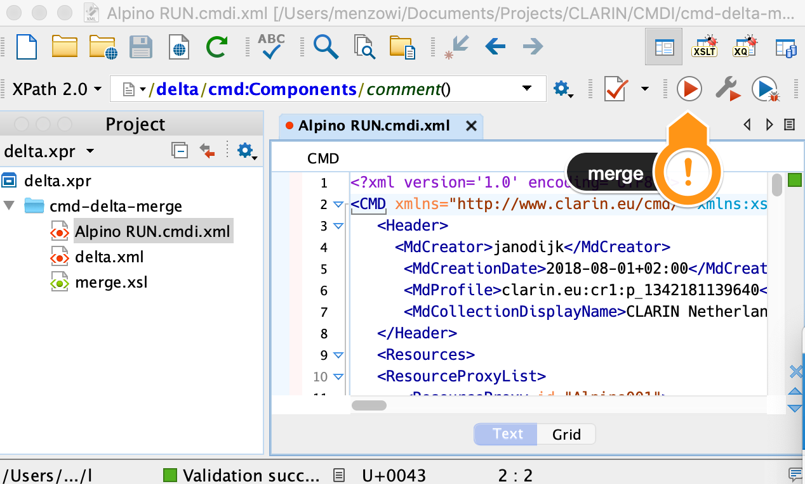

# CMD delta merge

[XSLT](merge.xsl) to merge a __delta__ into a [CMD](https://ww.clarin.eu/cmdi) record. The delta contains an XML fragment of the parts of the record to be updated or inserted. The delta is minimalistic, i.e., only contains the part that has new values. The merge process will make sure the inserted XML fragment contains the, according to the CMD profile, mandatory parts, so the record stays valid. 

To see this in action open the [oXygen](https://www.oxygenxml.com/) project, open the example record and run the associated transformation:

Or on the commandline using [Saxon 10.1](https://www.saxonica.com/):

``sh
java  -jar SaxonHE10-1J/saxon-he-10.1.jar -s:Alpino\ RUN.cmdi.xml -xsl:merge.xsl +delta=delta.xml
``
